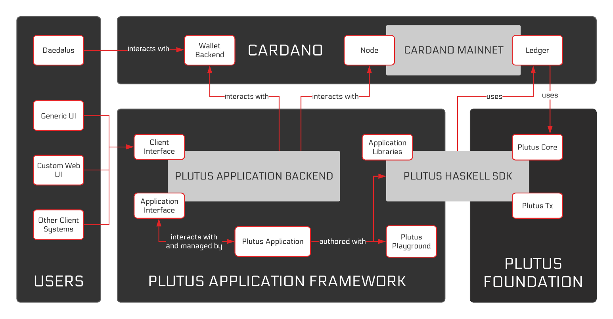

# What is Plutus?

Plutus is generally referred to as the smart contract language for Cardano. But IOG engineers more often refer to it as the _Plutus Platform_, which is made up of several different parts that enable writing applications that interact with the Cardano blockchain and take advantage of the validator script capabilities of the EUTxO model.

The Plutus Platform can therefore be separated into two main parts:

**1) The Plutus Foundation**

The Plutus Foundation provides the ledger with a way of specifying and executing scripts. This is done through a programming language called _**Plutus Core**_. Plutus Core is a small low-level functional programming language that acts as an on-chain _"assembly language"_. Because it is so low-level, it is not meant to be written by developers. Instead, it is a compilation target. The idea is to write Haskell code that then gets compiled down to Plutus Core for on-chain execution. This is where _**Plutus Tx**_ comes in as it provides a mechanism for compiling Haskell to Plutus Core. Plutus Tx contains the libraries and the compiler for such compilations, and their results form the on-chain parts of smart contract applications.

**2) The Plutus Application Framework**

The Plutus Application Framework provides support tools for writing applications in Plutus. It consists of several different tools such as:&#x20;

_Contract API_ - a component that provides an interface for writing the off-chain parts of Plutus applications. A useful tool that goes along is the _Contract monad emulator_ which is used to emulate a blockchain for testing contract instances.

_Plutus Application Backend (PAB)_ - a web server library that manages the state of Plutus contract instances and executes the off-chain components of Plutus applications. It currently does so by interacting with the _cardano-wallet_ backend and _caradno-node_ components while providing a client/application interface for the Plutus application. Not really production ready yet (only hosted option available).

_Various other libraries_ - provide a full framework for writing Plutus applications. A full list can be found here: [https://plutus-apps.readthedocs.io/en/latest/plutus/explanations/plutus-tools-component-descriptions.html#plutus-tools-in-development](https://plutus-apps.readthedocs.io/en/latest/plutus/explanations/plutus-tools-component-descriptions.html#plutus-tools-in-development).

All these tools are located in the _plutus-apps_ repository ([https://github.com/input-output-hk/plutus-apps](https://github.com/input-output-hk/plutus-apps)).

<figure><figcaption>
A high-level architecture of the Plutus Platform, with an emphasis on applications (<a href="https://playground.plutus.iohkdev.io/doc/plutus/explanations/platform.html">https://playground.plutus.iohkdev.io/doc/plutus/explanations/platform.html</a> - deprecated link).
</figcaption></figure>

###

###
